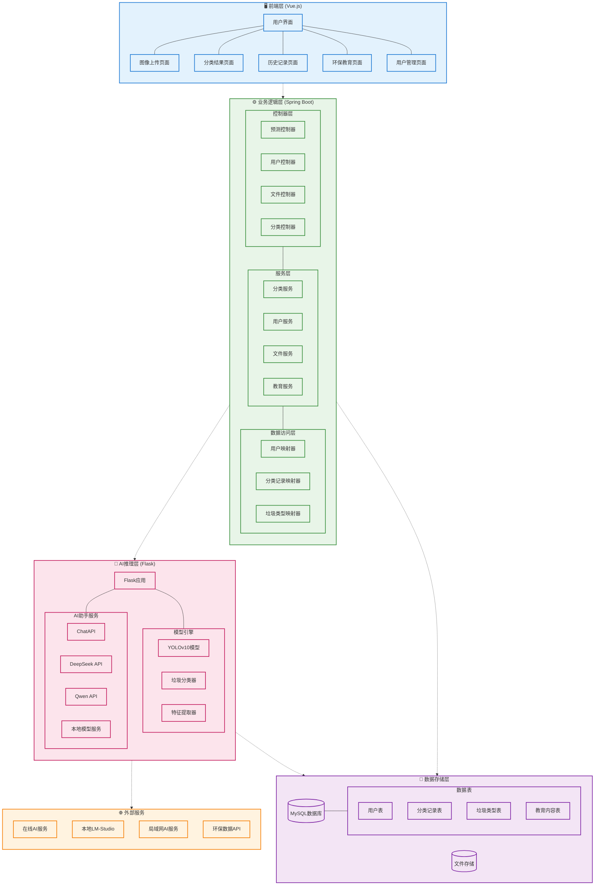
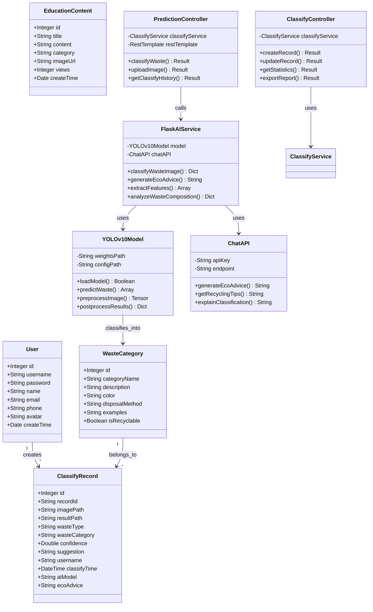
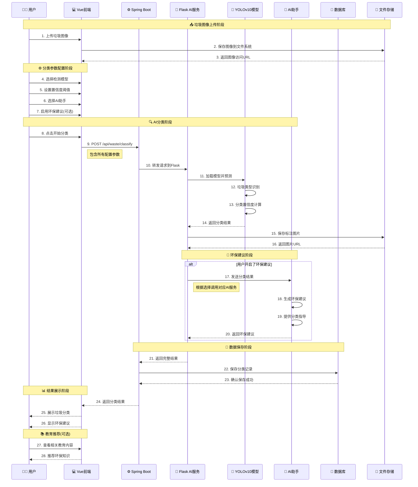
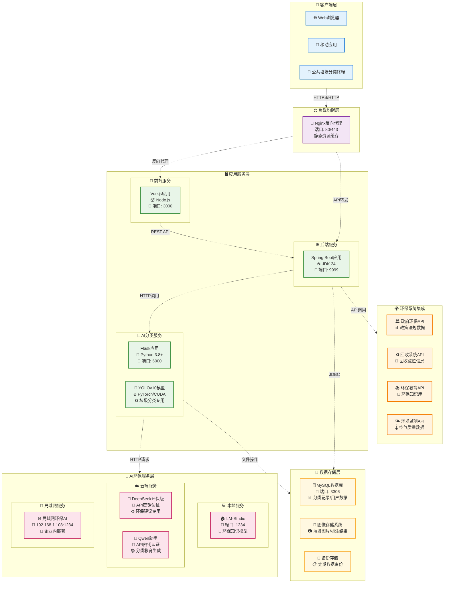

# 📱 基于计算机视觉和自然语言处理的生活垃圾分类检测系统

[](https://opensource.org/licenses/MIT)
[](https://openjdk.java.net/)
[](https://spring.io/projects/spring-boot)
[](https://vuejs.org/)
[](https://www.python.org/)

本系统是一个结合了计算机视觉和自然语言处理的智能垃圾分类检测系统。系统通过YOLOv10目标检测技术识别生活垃圾类型，并使用大语言模型提供环保建议和分类指导，帮助用户正确进行垃圾分类。

## 📋 目录

- [🏗️ 系统架构](#️-系统架构)
  - [📋 架构概览](#-架构概览)
- [🎯 主要功能](#-主要功能)
- [🗄️ 数据模型设计](#️-数据模型设计)
  - [📊 实体关系图](#-实体关系图)
- [🔄 系统流程设计](#-系统流程设计)
  - [⏱️ 垃圾分类检测流程时序图](#️-垃圾分类检测流程时序图)
- [🚀 部署架构](#-部署架构)
- [💻 技术栈](#-技术栈)
- [⚡ 快速开始](#-快速开始)
- [🤖 大模型部署与使用](#-大模型部署与使用)
- [🔗 系统访问](#-系统访问)
- [📖 使用说明](#-使用说明)
- [🎯 模型信息](#-模型信息)
- [📄 许可证](#-许可证)

---

## 🏗️ 系统架构

### 📋 架构概览



---

## 🎯 主要功能

- **📸 垃圾图像识别**：支持上传垃圾图像进行智能分类识别
- **🗂️ 多类别分类**：识别可回收物、有害垃圾、湿垃圾、干垃圾等多种类型
- **🎬 视频流检测**：支持实时视频流垃圾分类
- **🧠 AI环保建议**：使用大语言模型生成环保知识和分类指导
- **📋 分类记录管理**：垃圾分类历史记录管理和统计
- **📚 环保教育**：提供垃圾分类知识和环保教育内容
- **👥 用户管理**：用户系统和权限控制

---

## 🗄️ 数据模型设计

### 📊 实体关系图



---

## 🔄 系统流程设计

### ⏱️ 垃圾分类检测流程时序图



---

## 🚀 部署架构

### 🖥️ 部署架构图



---

## 💻 技术栈

### 🎨 前端技术
- **框架**: Vue 3 + TypeScript
- **UI库**: Element Plus
- **构建工具**: Vite
- **状态管理**: Pinia
- **HTTP客户端**: Axios

### ⚙️ 后端技术
- **框架**: Spring Boot 3.5.4
- **Java版本**: JDK 24 (最新版本)
- **数据库**: MySQL 8.0+
- **ORM**: MyBatis-Plus
- **文档**: Swagger/OpenAPI

### 🤖 AI技术栈
- **推理框架**: Flask + SocketIO
- **深度学习**: YOLOv10
- **模型库**: Ultralytics, PyTorch
- **大语言模型**: DeepSeek, Qwen, 本地LLM
- **GPU加速**: CUDA

### 🛠️ 工具与部署
- **视频处理**: FFmpeg
- **数据库**: MySQL
- **本地AI**: LM-Studio
- **代理服务**: Nginx (可选)
- **容器化**: Docker (可选)

---

## ⚡ 快速开始

### 前提条件

- **JDK 24** (已升级到最新版本，包含性能优化和安全改进)
- Node.js 16+
- Python 3.8+
- MySQL 8.0+
- CUDA支持的GPU (推荐用于模型推理)
- LM-Studio (用于本地部署大模型)

### 数据库配置

1. 创建名为`ai`的数据库
2. 运行`database.sql`脚本初始化数据库结构

### 后端服务启动

1. 进入springboot目录
2. 使用Maven构建项目：`mvn clean package`
3. 运行生成的jar文件：`java -jar target/Kcsj-0.0.1-SNAPSHOT.jar`

### AI服务启动

1. 进入flask目录
2. 安装依赖：`pip install -r requirements.txt`
3. 启动Flask服务：
   ```bash
   python main\(YOLO\).py  # YOLOv10模型
   # 或
   python main\(DETR\).py  # RT-DETR模型
   ```

### 前端启动

1. 进入vue目录
2. 安装依赖：`npm install`
3. 启动开发服务器：`npm run dev`
4. 构建生产版本：`npm run build`

---

## 🤖 大模型部署与使用

本系统支持多种大模型部署方式，用于生成环保建议和分类指导：

### 支持的模型

- **云端API模型**
  - Deepseek-R1
  - Qwen

- **局域网部署模型**
  - Deepseek-R1-LAN
  - Qwen3-LAN
  - Qwen2.5-VL-LAN
  - Qwen2.5-Omni-LAN
  - Gemma3-LAN

- **本地部署模型**
  - Deepseek-R1-Local
  - Qwen3-Local
  - Qwen2.5-VL-Local
  - Qwen2.5-Omni-Local
  - Gemma3-Local

### 使用LM-Studio进行本地部署

1. 下载并安装 [LM-Studio](https://lmstudio.ai/)
2. 从Hugging Face或其他来源下载所需模型（如Deepseek-R1、Qwen等）
3. 在LM-Studio中加载模型
4. 启动本地API服务器（通常在http://localhost:1234）
5. 在系统设置中选择对应的"本地"模型选项

---

## 🔗 系统访问

- 前端页面：http://localhost:3000
- Spring Boot 后端：http://localhost:9999
- Flask AI 服务：http://localhost:5000

### 默认登录账号

- **管理员账号**：admin
- **密码**：admin123

---

## 📖 使用说明

1. 访问系统前端界面
2. 使用默认管理员账号登录：admin/admin123
3. 进入系统后可以使用：
   - 垃圾分类：上传垃圾图片进行智能分类
   - 实时检测：使用摄像头进行实时垃圾分类
   - 历史记录：查看分类历史和统计数据
   - 环保教育：学习垃圾分类知识和环保常识
4. 选择合适的大模型获取个性化环保建议

---

## 🎯 模型信息

### 垃圾分类模型

本系统使用YOLOv10模型对垃圾进行分类检测。预训练模型存储在`flask/weights/`目录下，支持以下垃圾类别：

- 🗑️ **干垃圾**：餐具、包装袋、卫生纸等
- 🥬 **湿垃圾**：果皮、菜叶、剩饭剩菜等  
- ♻️ **可回收物**：塑料瓶、纸张、金属等
- ⚠️ **有害垃圾**：电池、化学品、灯管等

### 大语言模型

支持多种大语言模型，既可以通过API密钥访问云端模型，也可以通过LM-Studio在本地部署运行。系统会根据选定的模型自动配置请求参数，提供个性化的环保建议和分类指导。

---

## 📄 许可证

MIT

---

## 🤝 贡献

欢迎提交问题和贡献代码，请通过创建Issue或Pull Request参与项目开发。

---

## 🙏 致谢

感谢所有为本项目提供支持和贡献的人员，以及为环保事业做出贡献的每一个人。让我们一起为地球的未来努力！ 🌍♻️
